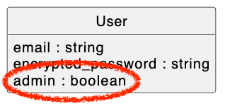

# Admin User Attribute Demo

This demonstration shows how to add a `boolean` attribute `admin` to a [Devise](https://github.com/heartcombo/devise#readme)-generated `User` model class. The purpose of this attribute is to distinguish admin users from non-admin users (if `true`, then user is an admin; else, the user is not an admin).

If you would like to follow along with the video, clone this repo and switch to the `version-before-demo` branch. The `main` (default) branch holds the solution.

## Demo Video (7 minutes)

[](https://youtu.be/7kUfd5Z59dw?si=yqa74LcTYOhb7b3g)

### [🎦 Watch the Video Demo](https://youtu.be/7kUfd5Z59dw?si=yqa74LcTYOhb7b3g)

## Steps to Add `admin` Attribute to Devise `User` Class

### ① Generate Migration to Add Admin Attribute to Users

Generate a database migration that adds a `boolean` attribute `admin` to the `users` table.

```sh
rails generate migration AddAdminToUsers admin:boolean
```

### ② Make Admin Attribute Default to False

In the generated migration script, update the `add_column` line to make the `admin` attribute default to `false`.

```ruby
add_column :users, :admin, :boolean, default: false
```

### ③ Run Migration

Run the migration to add the `admin` column to the `users` database table.

```sh
rails db:migrate:reset
```

### ④ Add Admin User to Seeds

Update `seeds.rb` script to create an admin user. Then run the script (`rails db:seed`).

```ruby
admin1 = User.create!(
  email:    'charlie@email.com',
  password: 'password',
  admin:    true
)
```

## Beyond this Demo

- Given a `User` object referenced by `@user`, you are now able to say `@user.admin?` to check whether the user is an admin.
- To secure a controller action such that only admin users can access it, a `before_action` can be employed, like this:

```ruby
class SecuredThingsController < ApplicationController
  before_action :authenticate_user!
  before_action :require_admin
 
  ...
 
  def require_admin
    if !current_user.admin?
      flash[:error] = 'You do not have permission to do that.'
      redirect_to unsecured_things_url
    end
  end
end
```

- You would likely want to add features for managing admin users. For example, you may want an interface that allows an admin user to bestow a non-admin user with admin permissions (by setting their `admin` attribute to `true`).
